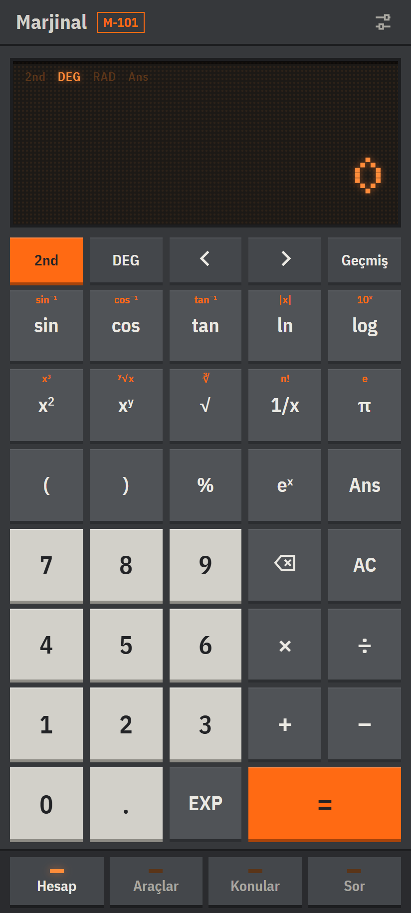
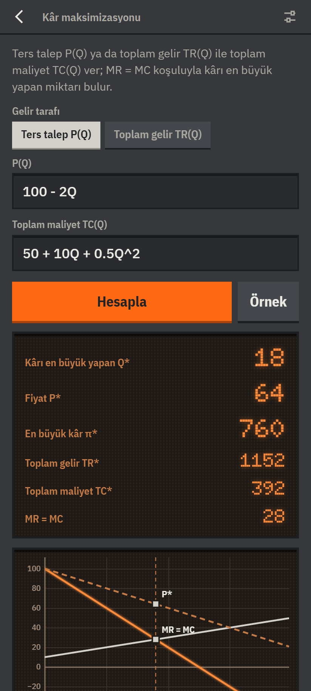
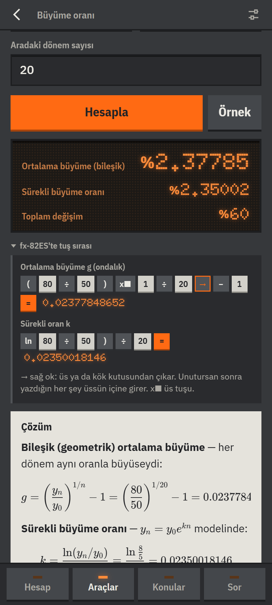
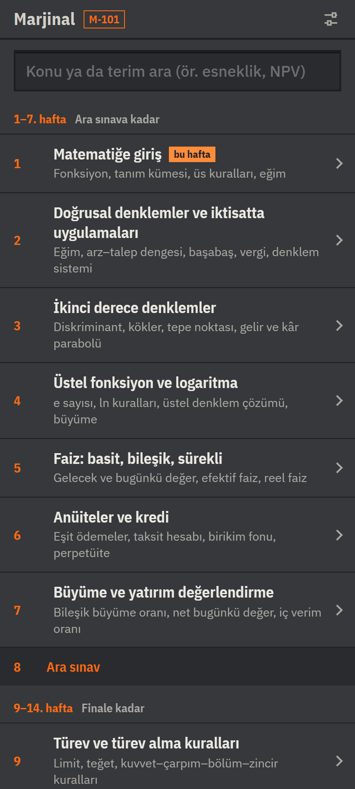

# Marjinal M-101

İktisat birinci sınıf **Mathematics I** dersi için Android hesap makinesi: bilimsel hesap, ders konularına
göre dizilmiş hesap araçları, haftalık konu anlatımları ve takılınca soru sorulabilen DeepSeek bağlantısı.
Tamamen çevrimdışı çalışır; internet yalnız soru sorarken gerekir.

<p>




</p>

## İçinde ne var
- **Hesap** — bilimsel hesap makinesi (2nd işlevleri, DEG/RAD, Ans, geçmiş).
- **Araçlar** — grafik, denklem çözme, doğru denklemi, doğrusal sistem, piyasa dengesi ve vergi, başabaş,
  ikinci derece, logaritma, büyüme oranı, faiz, TVM, kredi tablosu, NBD/İVO, türev ve teğet, maksimum/minimum,
  kâr maksimizasyonu, esneklik, marjinal/ortalama maliyet, integral, tüketici/üretici artığı,
  marjinalden toplam fonksiyon, gelir akışının bugünkü değeri, matris (Leontief dahil).
  Her sonuç adım adım çözümle ve grafikle gelir; sayısal araçlarda **Casio fx-82ES tuş sırası** da var.
- **Konular** — 14 haftanın özeti, formüller, iktisatta kullanımı, çözümlü örnek, sık yapılan hatalar,
  İngilizce–Türkçe terimler.
- **Sor** — DeepSeek'e metin ya da fotoğrafla soru. Kendi API anahtarını Ayarlar'dan girersin; anahtar
  yalnız telefonda saklanır ve yalnız `api.deepseek.com`'a gönderilir.

## Kurulum
**Tarayıcıda dene:** https://ascarry-eng.github.io/Econcalc/ (bilgisayarda da açılır).

**Android:** [Releases](../../releases) sayfasından son `Marjinal.apk`'yı telefona indirip aç. Android "bilinmeyen
kaynak" izni ister; Play Protect uyarırsa "Yine de yükle". Android 8.0 ve üstü.

## Geliştirme
- `www/` — uygulamanın kendisi (HTML/CSS/JS). Masaüstünde `www/index.html` doğrudan açılır.
  - `js/motor.js` hesap çekirdeği · `js/araclar_tanim.js` araçların hesabı · `js/konular.js` ders içeriği
- `apk/` — Android kabuğu (tek WebView) ve Gradle'sız derleme betiği `derle.py`
- `test/` — testler
- `_npm/` — kütüphanelerin kaynağı; `cd _npm && npm install`, ardından `node kutuphane_kopyala.js`

Testler:
```
node test/motor_test.js
node test/araclar_test.js        # fx-82ES tuş sıraları bir öykünücüde de sınanır
node test/etkilesim_test.js      # --api: gerçek DeepSeek çağrısı (DEEPSEEK_API_KEY gerekir)
node test/ekran_test.js <klasör> # telefon boyutunda ekran görüntüleri
```

APK derlemek: `python apk/derle.py` → `apk/cikti/Marjinal.apk`. Gerekenler: JDK 17+ (`JAVA_HOME`),
`apk/sdk/` altında Android build-tools 35.0.1 ve platform android-35 (depoda yok, Google'dan indirilir).
İmza anahtarı (`apk/marjinal.jks`) ve şifresi (`apk/imza_sifre.txt`) depoda değildir; yoksa ilk derlemede
yenisi üretilir. Aynı telefondaki uygulamayı güncellemek için hep aynı anahtar kullanılmalıdır.

## Lisans
Marjinal'in kendi kodu **MIT** lisanslıdır ([LICENSE](LICENSE)): serbestçe kullanabilir, değiştirebilir,
dağıtabilirsin; telif notunu koruman yeterli.

İçinde dağıtılan kütüphane ve yazı tipleri kendi lisanslarıyla gelir (`www/lib/lisanslar/`):
math.js (Apache-2.0), nerdamer, KaTeX, marked (MIT), Doto ve IBM Plex (SIL OFL 1.1).
